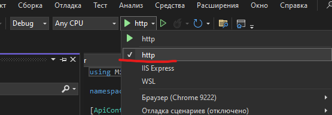

# FinstarTask

### Стек
- ASP.Net Core 8
- MS SQL
- Entity Framework
- Node v18.14.2 +
- React
- Antd

### 1. Подготовка
##### 1.1 Конфигурирование подключения к БД
- Откройте файл <strong>FinstarTask.Server\Program.cs</strong>
- Найдите строку подключения к БД и исправьте ее в случае необходимости

Используемая учетная запись должна иметь права DDL\DML

##### 1.2 Убедитесь, что у Вас установлен NodeJs версии 18.14.2+
``` bash
  node --version
```
> работоспособность с другими версиями не проверялась


##### 1.3 Установка библиотек
- В терминале откройте каталог <strong>finstartask.client</strong>
- Выполните команду и дождитесь ее выполнения
``` bash
  npm install && npm run build
```

### 2. Запуск
- В Visual Studio выбирете прокт по умлочанию

- В параметрах запуска выберите <strong>http</strong>

- Нажмите <strong>F5</strong>. Должна открыться консоль

- Откройте в браузере https://localhost:5173

